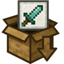
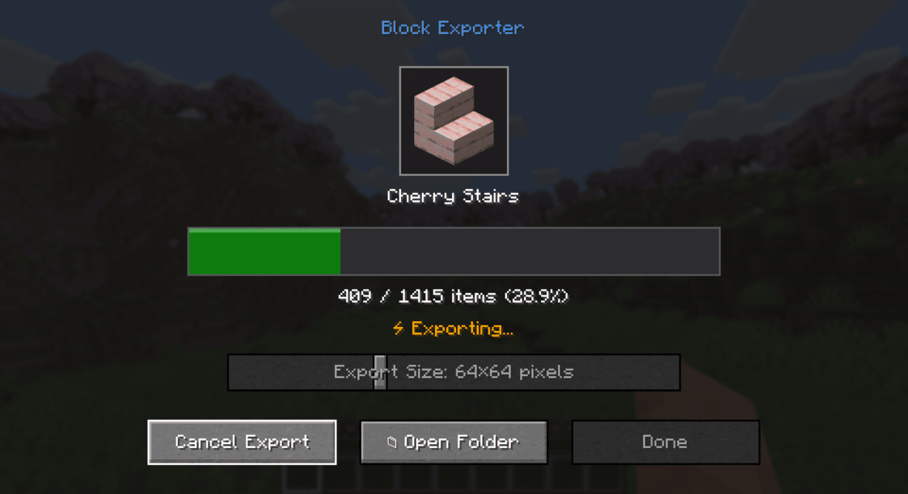

# Block Exporter

A Minecraft mod that exports item renders as they appear in inventory slots.

## Supported Platforms
- Modern Minecraft with:
  - Fabric
  - NeoForge
  - Forge
- Minecraft Beta 1.7.3 (with ModLoader)

## Requirements
- One of the supported mod loaders mentioned above

## Usage
1. Install the mod along with the required API for your mod loader
2. Launch Minecraft
3. Press the "i" key to open the export menu
4. Find the exported textures in the `item_exports` folder inside your Minecraft directory

## Output Format
- Each texture is saved as a PNG file
- File naming format: `namespace_itemid.png` (e.g., `minecraft_diamond.png`)
- Available output sizes: 16x16, 32x32, 64x64, 128x128, 512x512, 1024x1024 pixels
- Images include transparency where applicable

## License
This project is licensed under the MIT License - see the LICENSE file for details. 
